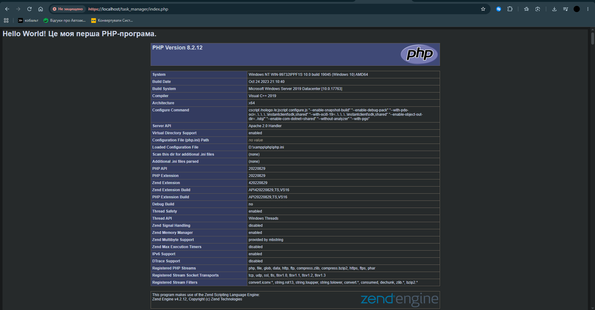

# Звіт до Лабораторної роботи №1

## Фрагмент коду

```
<?php
    echo "<h1>Hello World! Це моя перша PHP-програма.</h1>";
    phpinfo();
?>
```

## Результат виконання роботи



## Відповіді на контрольні запитання

**1. Яке призначення вебсервера (наприклад, Apache) у процесі веброзробки?**
    Apache виступає посередником між браузером і кодом php. Приймає HTTP-запити, передає PHP-файли на виконання та повертає браузеру готовий результат у форматі HTML

**2. Яким розширенням файлу повинен володіти скрипт, щоб сервер обробив його як PHP-код?**
    Файл повинен мати розширення .php, щоб сервер розумів, що в ньому код який треба спочатку передати на виконання, а не просто віправити текстом у браузер

**3. Чому PHP-файл потрібно відкривати через браузер за адресою localhost, а не просто подвійним кліком миші у файловому менеджері?**
    Тому що, файл відкриється звичайним текстовим документом із сирим кодом, який побачить користувач, а не сам результат цього коду

**4. За що відповідає конструкція echo у PHP?**
    echo відповідає за виведення тексту, змінних або HTML-коду у вихідний потік, яка надсилається в браузер

**5. Яку інформацію виводить функція phpinfo() і для чого вона може знадобитись?**
    Вона виводить повну інформацію про конфігурацію PHP (версію, підключені модулі, ліміти пам'яті, налаштування)   