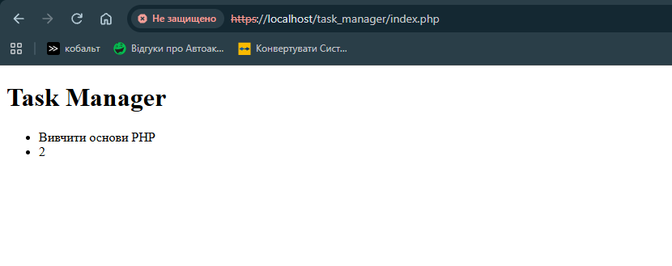

# Звіт до Лабораторної роботи №2

## Фрагмент коду

```
<?php 
$appName = "Task Manager";
$taskTitle = "Вивчити основи PHP";
$taskTimeEstimate = 2;
?>
```
```
    <header>
        <h1><?= $appName ?></h1>
    </header> 
    <main>
        <ul>
            <li><?= $taskTitle ?></li>
            <li><?= $taskTimeEstimate ?></li>
        </ul>
    </main>
```

## Результат виконання роботи



## Відповіді на контрольні запитання

**1. Що таке динамічна типізація і як вона працює в PHP?**
    Динамічна типізація - це коли тип змінної визначається в момент присвоєння значення, а не під час її оголошення
    $data = 10; - тип int
    $data = "Hello, Wordl"; - тип string

**2. Як правильно розпочати і закрити блок з PHP-кодом всередині HTML-документа?**
    Блок PHP-коду відкривається тегом <?php і закривається тегом ?>. Все інше за цими тегами інтерпретується як звичайний html-текст

**3. В чому різниця між записами <?php echo $var; ?> та <?= $var ?>?**
    <?= $var ?> - це короткий та зручніший вид <?php echo $var; ?>. Виконують вони одну й ту саму дію - виводять змінну

**4. Які основні (скалярні) типи даних підтримує PHP? Наведіть приклади.**
    У PHP є 4 основні скалярні типи даних: bool - приймає true або false; int - чілі числа; float - дробові числа; string - рядок символів.
    $task = true;
    $time = 2;
    $price = 9.11;
    $appName = "Task Manager";

**5. Що буде виведено в браузері, якщо користувач відкриє файл .html, всередині якого буде вбудовано <?php echo "Test"; ?> без налаштувань сервера? Поясніть чому.**
    php код виконує сервер, а не браузер, тому без сервера користувач нічого не побачить на екрані
